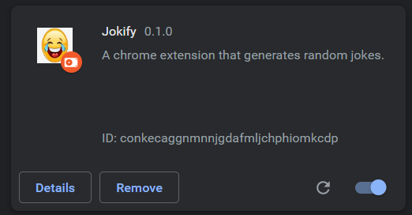
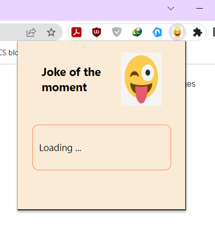
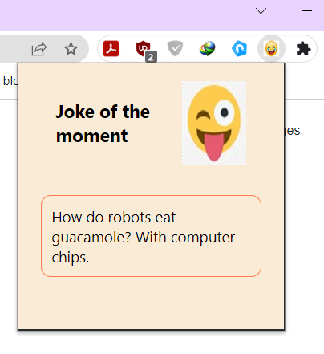

# Jokify

Bored of surfing the internet !! Well, then your are at the right place. We got a Simple Google chrome extension that generates random jokes for you.

## Features

- Generates random jokes using the https://icanhazdadjoke.com/api API
- uses Manifest version 2

## Installation

Follow the steps for installing the extension:

- Step-1: Toggle the developer option in extension page to turn on the developer option.
- Step-2: Clone the repo in a folder.
- Step-3: From the extension page select the 'Load unpacked' option and move inside the clonned repo folder and select the folder.
- Step-4: Boom!! Your Extension is now ready to use.
    
## Screenshots

